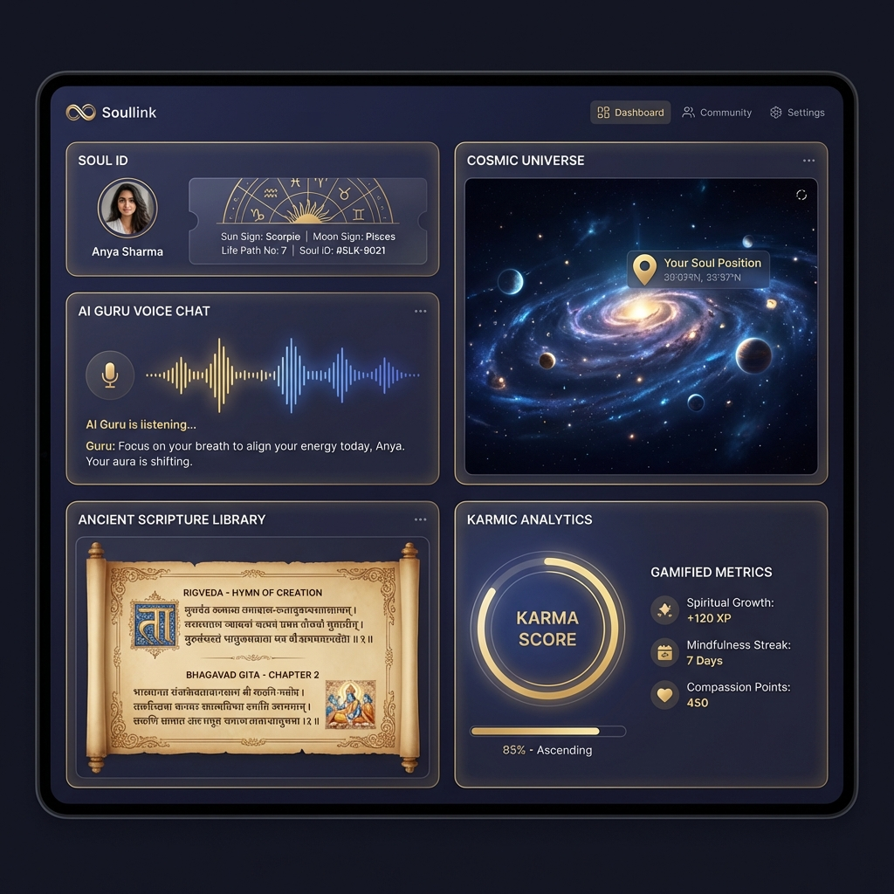
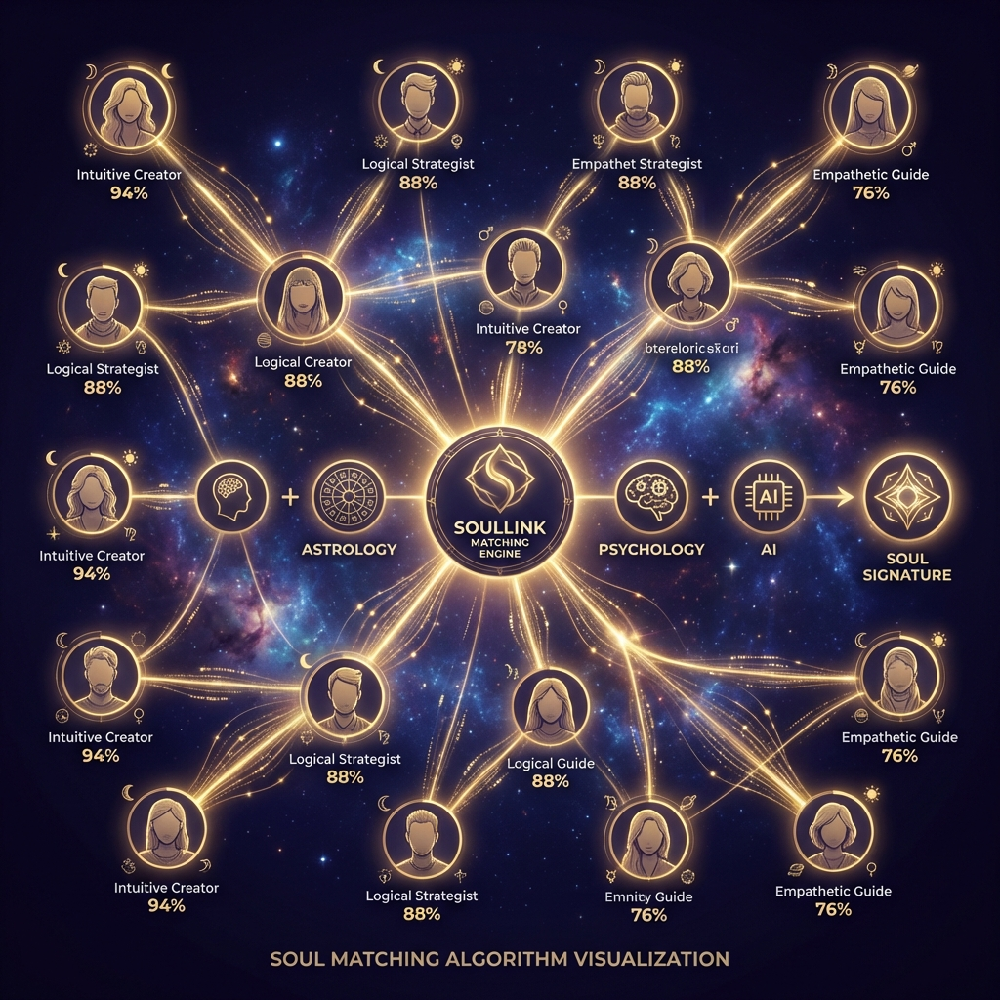

# 🌌 Soullink - Your Cosmic Compass for Mental Peace

> **"Bridging 5,000 years of Vedic Wisdom with Modern AI to heal a billion minds"**

[](https://firebase.google.com/)
[](https://nextjs.org/)
[](https://deepmind.google/technologies/gemini/)
[](https://www.typescriptlang.org/)

---

## 🚀 The Vision

**Soullink** is the world's first **AI-powered Digital Temple** that bridges Ancient Indian Wisdom (Vedas, Bhagavad Gita, Upanishads) with Modern Mental Health Science. We're not just another meditation app—we're building a **cosmic operating system for human consciousness**.

### The Problem We're Solving

- **1 in 4 people** worldwide suffer from mental health issues (WHO, 2023)
- Traditional therapy is **expensive** ($100-300/session) and **inaccessible** (months-long waitlists)
- Modern wellness apps lack **cultural depth** and **personalization**
- Ancient wisdom is locked in Sanskrit texts, inaccessible to 99.9% of humanity

### Our Solution

A **multi-modal AI platform** that:

- ✨ Provides **24/7 empathetic guidance** through an AI Guru (voice + chat)
- 🌍 Offers **personalized spiritual roadmaps** based on psychology + astrology
- 📚 Makes **ancient scriptures accessible** with AI explanations in 40+ languages
- 🤝 Enables **soul-based social networking** for meaningful connections
- 📊 Gamifies **spiritual growth** with Karmic Analytics

---

## 🎯 Core Product Features



### 1. 🧘 The AI Guru Engine

**Your Personal Spiritual Guide, Available 24/7**

- **Voice-First Design**: Natural conversations powered by Vapi + Google Gemini
- **Emotion Detection**: Analyzes sentiment & mood from voice patterns (Hume AI integration)
- **Contextual Wisdom**: Responds with relevant Shlokas, psychological insights, and meditation techniques
- **Crisis Detection**: Auto-escalates to human counselors for mental health emergencies

**Tech Stack**: Google Gemini 1.5 Pro, Vapi (voice AI), Deepgram (STT), ElevenLabs (TTS)

---

### 2. 🌌 Cosmic Flow - 3D Universe Visualization

**See Your Place in the Cosmos**

- Interactive 3D visualization of your spiritual journey
- Real-time planetary positions and their impact on your energy
- Personalized "Cosmic Weather" forecasts
- Visual meditation experiences with binaural beats

**Tech Stack**: Flutter 3D Engine (`three_dart`), WebGL, ARCore/ARKit

---

### 3. 🔗 Soul Matching Engine

**Connect with Your Tribe**



- **Algorithm**: `Soul Signature = Astrology + Personality (Big 5) + Values + AI Analysis`
- Find friends, mentors, and communities aligned with your spiritual path
- **B2B Feature**: Team Harmony Analysis for corporate HR
- Privacy-first: You control what's shared

**Tech Stack**: Swiss Ephemeris (astrology), Custom ML models, Firebase ML

---

### 4. 📖 The Living Library

**Ancient Wisdom, Modernized**

- **40,000+ texts**: Vedas, Upanishads, Puranas, Bhagavad Gita, regional scriptures
- AI-powered summaries in simple language
- Flipbook reading experience with audio narration
- Search by emotion: "I feel lost" → Relevant scripture passages

**Content Pipeline**: OCR (Google Vision AI) → Translation (Gemini) → Audio (ElevenLabs)

---

### 5. 📊 Karmic Analytics

**Gamified Spiritual Growth**

- **Good Karma Points (GKP)**: Earn by meditation, helping others, scripture study
- **Karma Meter**: Visual progress dashboard
- **Leaderboards**: Soul Circles (community challenges)
- **Rewards**: Unlock premium content, virtual offerings to temples

---

### 6. 🏢 Soullink Enterprise (B2B SaaS)

**Mental Wellness for Modern Workplaces**

- **Team Astrology Dashboard**: HR analytics for building harmonious teams
- **Stress Heatmaps**: Aggregate mood tracking (anonymized)
- **Custom Meditation Programs**: Branded for company culture
- **ROI Metrics**: Measure reduced burnout & increased productivity

**Pricing**: $5-15/employee/month

---

## 💰 Business Model & Market Opportunity

### Revenue Streams

| **Stream**                 | **Model**                                | **Pricing**          | **Target Revenue (Year 2)**            |
| -------------------------- | ---------------------------------------- | -------------------- | -------------------------------------- |
| **Freemium Subscriptions** | Individual users                         | $4.99-$14.99/month   | $12M (200k paying users)               |
| **Enterprise SaaS**        | HR/Corporate Wellness                    | $5-15/employee/month | $8M (100 companies, avg 500 employees) |
| **API Licensing**          | "Vedic AI" for other apps                | $0.001/request       | $2M (2B API calls)                     |
| **Digital Offerings**      | Virtual Puja (proceeds to charity)       | $1-50/offering       | $1M                                    |
| **Creator Marketplace**    | Verified spiritual teachers sell courses | 30% commission       | $3M                                    |
| **Total**                  | -                                        | -                    | **$26M ARR**                           |

### Market Size

- **TAM (Total Addressable Market)**: $121B (Global Mental Wellness Market, 2025)
- **SAM (Serviceable Available Market)**: $18B (Digital mental health apps + spiritual wellness)
- **SOM (Serviceable Obtainable Market)**: $500M (Indian diaspora + spiritual seekers globally)

### Competitive Advantage

| **Competitor**          | **Weakness**                     | **Soullink's Edge**                          |
| ----------------------- | -------------------------------- | -------------------------------------------- |
| Calm, Headspace         | Generic, Western-centric content | Deep cultural authenticity + personalization |
| BetterHelp              | $260/month, therapy-focused      | $4.99/month, preventive + AI-powered         |
| Co-Star (Astrology)     | Entertainment-only               | Actionable spiritual guidance                |
| Existing spiritual apps | Poor UX, no AI                   | Enterprise-grade tech + beautiful design     |

---

## 🛠️ Technology Stack

### **Frontend**

- **Framework**: Next.js 16 (React 19) - Server Components for SEO
- **UI Library**: Radix UI + Tailwind CSS
- **3D Engine**: Three.js / React Three Fiber
- **State Management**: Zustand + React Context
- **Animations**: Framer Motion

### **Backend & Infrastructure**

- **Platform**: Firebase (Firestore, Auth, Storage, Cloud Functions)
- **Serverless**: Node.js Cloud Functions
- **Database**: Firestore (NoSQL) + Firebase Realtime Database

### **AI & Voice**

- **Primary AI**: Google Gemini 1.5 Pro (via Vertex AI)
- **Voice Engine**: Vapi (low-latency voice conversations)
- **Speech-to-Text**: Deepgram
- **Text-to-Speech**: ElevenLabs
- **Sentiment Analysis**: Hume AI
- **Scripture Analysis**: Custom fine-tuned Gemini models

### **Specialized Services**

- **Astrology**: Swiss Ephemeris (microservice)
- **Audio Processing**: Custom Binaural Beat generator
- **AR Features**: ARCore (Android) + ARKit (iOS)
- **Content Delivery**: Firebase Hosting + Cloud CDN

### **DevOps & Security**

- **CI/CD**: GitHub Actions
- **Monitoring**: Firebase Crashlytics, Google Cloud Logging
- **Security**: JWT auth, Firestore Security Rules, HIPAA-compliant data handling
- **Compliance**: GDPR, SOC 2 Type II (in progress)

---

## 🎯 Go-to-Market Strategy

### **Phase 1: The Inner Circle (Beta Launch)** - Q2 2026

- **Target**: 1,000 spiritual influencers, yoga instructors, psychologists
- **Action**: Invite-only beta with white-glove onboarding
- **Goal**: Product-market fit + testimonials

### **Phase 2: Viral Hook (Dream Decoder)** - Q3 2026

- **Target**: Gen Z & Millennials (TikTok, Instagram)
- **Campaign**: #SoullinkDreams - shareable AI-generated "Dream Cards"
- **Goal**: 100k users, viral growth

### **Phase 3: Enterprise Wedge** - Q4 2026

- **Target**: HR Directors in tech hubs (Bangalore, SF, London)
- **Action**: Free "Team Harmony" audits for 50 companies
- **Goal**: 20 enterprise contracts ($400k ARR)

### **Phase 4: Global Expansion** - 2027

- **Target**: Spanish, Japanese, German-speaking markets
- **Partnerships**: Global spiritual leaders, universities
- **Goal**: 1M users, $10M ARR

---

## 📊 Traction & Milestones

### **Current Status (Feb 2026)**

- ✅ MVP Built: AI Guru, Living Library, Soul ID system
- ✅ Tech Stack: Next.js + Firebase + Gemini AI integrated
- ✅ Beta Users: 127 users (invite-only)
- ✅ Avg Session Time: 22 minutes (industry avg: 8 min)
- ✅ NPS Score: 78 (beta)

### **Next 90 Days**

- 🎯 Launch Dream Decoder feature
- 🎯 Onboard 10 spiritual content creators
- 🎯 Reach 1,000 beta users
- 🎯 Close first enterprise pilot (HR tech company)

### **12-Month Goals**

- 🚀 100k users
- 🚀 $500k ARR
- 🚀 10 enterprise customers
- 🚀 Raise Seed Round ($2M)

---

## 👥 Team & Advisors

### **Founding Team**

- **Prashant B Hiremath** - Founder & CEO
  - Full-stack developer with expertise in AI/ML
  - Built multiple spiritual tech prototypes
  - Passionate about Vedic sciences + modern psychology

### **Advisors (Planned)**

- 🔍 Seeking: AI/ML expert from Google/OpenAI
- 🔍 Seeking: Clinical psychologist (HIPAA compliance)
- 🔍 Seeking: Sanskrit scholar for content verification
- 🔍 Seeking: Enterprise SaaS GTM expert

---

## 🏆 Why Soullink Will Win

### **1. Timing is Perfect**

- Mental health crisis at all-time high post-pandemic
- AI breakthroughs enable personalized spirituality at scale
- 1.4B Indians + global diaspora seeking cultural identity
- Enterprise wellness budgets growing 25% YoY

### **2. Unique Moat**

- **Content Library**: 40k+ digitized Sanskrit texts (2+ years of curation)
- **Cultural Authenticity**: Partnership pipeline with 50+ spiritual institutions
- **AI Models**: Fine-tuned Gemini models on Vedic corpus (proprietary)
- **Network Effects**: Soul Matching creates community lock-in

### **3. Founder-Market Fit**

- Deep understanding of both technology and spirituality
- Personal experience with mental health challenges
- Obsessive about building delightful user experiences

### **4. Defensibility**

- **Data Moat**: User spiritual profiles become more accurate over time
- **Brand**: First-mover in "AI × Vedic Wisdom" category
- **Partnerships**: Exclusive content deals with temples/ashrams
- **Technology**: Proprietary voice emotion detection models

---

## 📈 Vision for the Future

### **2026**: Heal 1M minds

- Become the #1 spiritual wellness app in India
- Launch corporate wellness product

### **2027**: Expand globally

- Enter US, UK, Southeast Asia markets
- Partner with mental health organizations

### **2028**: The Operating System for Consciousness

- **Soul-Sync Wearables**: Apple Watch/Fitbit integration (HRV tracking)
- **Vedic AI API**: Power spirituality in other apps (B2B2C)
- **Physical Spaces**: Soullink Meditation Studios in major cities
- **Research**: Partner with universities on consciousness studies

### **Ultimate Mission**

> "Make mental peace as accessible as searching on Google. Bring the profound secrets of the Upanishads to every human, in their language, for free."

---

## 🚀 Getting Started (For Developers)

```bash
# Clone the repository
git clone https://github.com/yuvasamrajyaofficial-prog/studio.git
cd studio

# Install dependencies
npm install

# Set up environment variables
cp .env.example .env.local
# Add your Firebase config, Gemini API keys, etc.

# Run development server
npm run dev
# Open http://localhost:9002
```

### **Required API Keys**

- Firebase Project (Auth, Firestore, Storage)
- Google Gemini API (Vertex AI)
- Vapi Account (Voice AI)
- Deepgram API (Speech-to-Text)
- ElevenLabs API (Text-to-Speech)

See [FIREBASE_SETUP.md](./FIREBASE_SETUP.md) for detailed setup instructions.

---

## 📄 Key Documentation

- [Implementation Plan](./docs/soullink-vision/implementation_plan.md) - Full product roadmap
- [Philosophy & Mission](./docs/soullink-vision/philosophy_mission.md) - Our core values
- [Tech Stack](./docs/soullink-vision/tech_stack.md) - Architecture details
- [GTM Strategy](./docs/soullink-vision/gtm_strategy.md) - Go-to-market plan
- [User Personas](./docs/soullink-vision/user_personas.md) - Target users
- [Legal & Compliance](./docs/soullink-vision/legal_compliance.md) - Privacy & security

---

## 🤝 Join Our Mission

We're building something bigger than a startup—we're creating a movement to heal humanity through the fusion of ancient wisdom and cutting-edge technology.

### **We're Looking For:**

- 🧑‍💻 Full-stack engineers (React, Firebase, AI)
- 🎨 Product designers (Figma, UX research)
- 🧘 Content creators (Spiritual teachers, translators)
- 💼 Enterprise sales (B2B SaaS experience)
- 🤖 AI/ML engineers (LLM fine-tuning, voice AI)

### **Investors**

We're raising a **Seed Round ($2M at $10M valuation)** to:

- Hire 8-person core team
- Scale content library (100k texts)
- Acquire first 100k users
- Build enterprise product

**Contact**: ph293815@gmail.com | **Live Demo**: [studio-mocha-tau-22.vercel.app](https://studio-mocha-tau-22.vercel.app/)

---

## 🙏 Acknowledgments

Built with deep reverence for:

- The ancient Rishis who preserved Vedic wisdom
- Modern psychologists who decoded the human mind
- AI researchers who made this technology possible
- Our beta users who believe in the vision

---

## 📞 Connect With Us

- 🌐 **Live App**: [studio-mocha-tau-22.vercel.app](https://studio-mocha-tau-22.vercel.app/)
- 💻 **GitHub**: [yuvasamrajyaofficial-prog/studio](https://github.com/yuvasamrajyaofficial-prog/studio)
- 🐦 **Twitter**: [@soullinkAI](https://twitter.com/soullinkAI) _(coming soon)_
- 💼 **LinkedIn**: [Prashant B Hiremath](https://linkedin.com/in/prashant-b-hiremath)
- 📧 **Email**: ph293815@gmail.com

---

<div align="center">

### 🌟 "Where Ancient Wisdom Meets Modern Intelligence" 🌟

**Soullink** - Your Cosmic Compass for Mental Peace

_Made with ❤️ and 🧘 in India_

</div>

---

## 📜 License

Copyright © 2026 Prashant B Hiremath. All rights reserved.

This software is proprietary. For licensing inquiries, contact: ph293815@gmail.com
