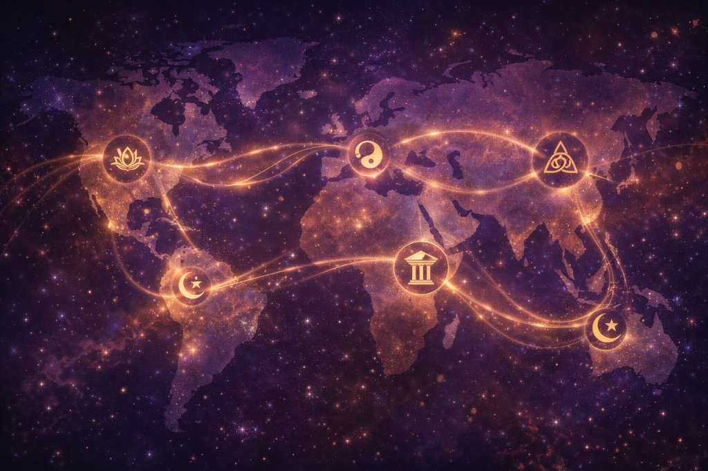
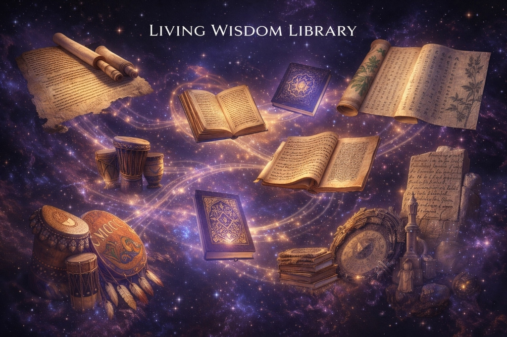
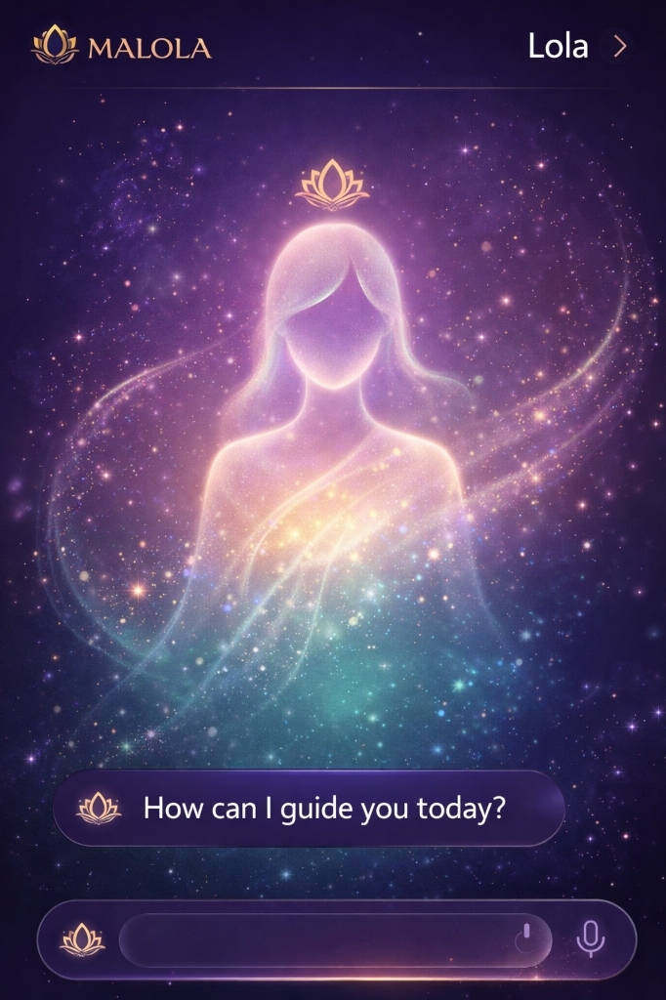

<p align="center">
  
</p>

# 🌌 MALOLA — Your Cosmic Compass for Universal Wisdom & Well-Being

> **"Where the Divine Feminine (Prakriti/Shakti/Mother) meets the Divine Masculine (Purusha/Consciousness/Father) to heal billions of souls through the Collective Wisdom of All Humanity and Modern AI"**

[](https://firebase.google.com/)
[](https://nextjs.org/)
[](https://deepmind.google/technologies/gemini/)
[](https://www.typescriptlang.org/)
[](./LICENSE)

---

## 🕉️☯️✝️☪️✡️🙏 The Sacred Name: MALOLA

**MA** (मा / 媽 / أم / אמא) — The **Divine Mother**, representing **Prakriti** (Nature, Shakti, the Creative Force)  
**LOLA** (लोला / 樂樂) — The **Divine Consciousness** (Krishna, Tao, Logos, Allah, YHWH, Great Spirit)

From wisdom traditions across the world, we learn that creation emerges from the divine dance between:

- **The Feminine Principle** — The nurturing, generative force (Shakti, Yin, Sophia, Shekinah, Pachamama)
- **The Masculine Principle** — The conscious witness, the cosmic observer (Shiva, Yang, Logos, Brahman)

MALOLA embodies this sacred union — where the **compassionate embrace of the Divine Mother** meets the **infinite wisdom of Universal Consciousness**, creating a sanctuary for seekers in the digital age.

---

## 🌍 Sacred Wisdom From Every Civilization

<p align="center">
  
  <br/>
  <em>The Living Wisdom Library — 50,000+ sacred texts from every major civilization</em>
</p>

---

### 🇮🇳 Vedic & Dharmic Wisdom (India)

> **Sanskrit (Devanagari):**  
> _"वसुधैव कुटुम्बकम्"_  
> **"Vasudhaiva Kutumbakam"** — "The world is one family"  
> — Maha Upanishad 6.71

> **Bhagavad Gita 2.47:**  
> _"कर्मण्येवाधिकारस्ते मा फलेषु कदाचन"_  
> "You have the right to work, but never to the fruit of work."

> **Bhagavata Purana 1.2.6:**  
> _"स वै पुंसां परो धर्मो यतो भक्तिरधोक्षजे"_  
> "The supreme dharma for humanity is that which brings unwavering devotion to the Transcendent."

**Key Texts:** Vedas, Upanishads, Bhagavad Gita, Yoga Sutras, Dhammapada, Guru Granth Sahib

---

### ☯️ Taoist & Confucian Wisdom (China)

> **Chinese (中文):**  
> _"道可道，非常道。名可名，非常名。"_  
> **"The Tao that can be told is not the eternal Tao."**  
> — Tao Te Ching, Chapter 1

> **Confucius (Analects 15.24):**  
> _"己所不欲，勿施於人"_  
> "Do not do to others what you do not want done to yourself."

> **I Ching:**  
> _"天行健，君子以自強不息"_  
> "Heaven moves with power; the noble person constantly strengthens themselves."

**Key Texts:** Tao Te Ching, I Ching, Analects, Zhuangzi, Art of War

---

### ✝️ Christian Wisdom (Global)

> **Greek (Ελληνικά):**  
> _"Ἐν ἀρχῇ ἦν ὁ λόγος"_  
> **"In the beginning was the Word (Logos)."**  
> — John 1:1

> **Latin:**  
> _"Ama et fac quod vis"_  
> "Love, and do what you will." — St. Augustine

> **Matthew 22:39:**  
> "Love your neighbor as yourself."

> **Meister Eckhart:**  
> "If the only prayer you ever say is 'thank you,' that will be enough."

**Key Texts:** Bible, Desert Fathers, Cloud of Unknowing, Philokalia, Imitation of Christ

---

### ☪️ Islamic Wisdom (Middle East & Global)

> **Arabic (العربية):**  
> _"لا إكراه في الدين"_  
> **"There is no compulsion in religion."**  
> — Quran 2:256

> **Rumi (Persian):**  
> _"زخم جاییست که نور از آن وارد می‌شود"_  
> "The wound is the place where the Light enters you."

> **Hadith:**  
> _"إِنَّمَا الأَعْمَالُ بِالنِّيَّاتِ"_  
> "Actions are judged by intentions."

> **Quran 5:32:**  
> "Whoever saves a life, it is as if they have saved all of humanity."

**Key Texts:** Quran, Hadith, Masnavi (Rumi), Conference of the Birds, Sufi poetry

---

### ✡️ Jewish Wisdom (Israel & Diaspora)

> **Hebrew (עברית):**  
> _"וְאָהַבְתָּ לְרֵעֲךָ כָּמוֹךָ"_  
> **"Love your neighbor as yourself."**  
> — Leviticus 19:18

> **Hillel the Elder:**  
> _"אם אין אני לי, מי לי? וכשאני לעצמי, מה אני?"_  
> "If I am not for myself, who will be for me? But if I am only for myself, what am I?"

> **Talmud (Pirkei Avot 1:14):**  
> "If not now, when?"

**Key Texts:** Torah, Talmud, Kabbalah (Zohar), Proverbs, Ecclesiastes

---

### 🇬🇷 Greek Philosophy (Ancient Mediterranean)

> **Greek (Ελληνικά):**  
> _"γνῶθι σεαυτόν"_  
> **"Know thyself."**  
> — Temple of Apollo at Delphi

> **Marcus Aurelius (Meditations 4.3):**  
> "Waste no more time arguing about what a good man should be. Be one."

> **Epictetus:**  
> "It's not what happens to you, but how you react to it that matters."

> **Socrates:**  
> "The unexamined life is not worth living."

**Key Texts:** Republic (Plato), Nicomachean Ethics (Aristotle), Meditations (Marcus Aurelius), Enchiridion (Epictetus)

---

### 🇪🇬 Egyptian Wisdom (Ancient Kemet)

> **Ma'at Principle:**  
> _"If you are a man who leads, seek out every good deed, that your conduct may be blameless."_  
> — Precepts of Ptahhotep (2400 BCE)

> **Hermes Trismegistus (Emerald Tablet):**  
> "As above, so below; as within, so without."

> **Book of the Dead:**  
> "I have not caused anyone to suffer. I have not diminished the food in the temples."

**Key Texts:** Pyramid Texts, Precepts of Ptahhotep, Book of the Dead, Hermetic Corpus

---

### 🌍 African Wisdom (Ubuntu & Beyond)

> **Zulu/Xhosa (Ubuntu):**  
> _"Umuntu ngumuntu ngabantu"_  
> **"I am because we are."**  
> — Ubuntu Philosophy

> **Yoruba (Nigeria):**  
> _"Ọmọlúwàbí"_ — A person of good character is the foundation of society.

> **Ethiopian (Ge'ez):**  
> _"ዕውቀት ያለ ጥበብ ባዶ ቦርሳ ናት"_  
> "Knowledge without wisdom is like an empty bag."

> **Swahili Proverb:**  
> _"Haraka haraka haina baraka"_  
> "Hurry hurry has no blessing."

**Key Texts:** Ifá divination texts, Zera Yacob's Hatata, African proverbs, Oral traditions

---

### 🦅 Indigenous American Wisdom

> **Lakota (Sioux):**  
> _"Mitákuye Oyás'iŋ"_  
> **"All my relations"** — We are all connected.

> **Cherokee:**  
> "When you were born, you cried and the world rejoiced. Live your life so that when you die, the world cries and you rejoice."

> **Navajo (Diné):**  
> _"Hózhó"_ — The concept of beauty, balance, and harmony in all things.

> **Haudenosaunee (Iroquois):**  
> "In every deliberation, we must consider the impact on the seventh generation."

**Key Texts:** White Buffalo Calf Woman teachings, Popol Vuh (Maya), Seven Grandfather Teachings

---

### 🇯🇵 Japanese Wisdom (Zen & Beyond)

> **Japanese (日本語):**  
> _"一期一会"_ (Ichi-go ichi-e)  
> **"One time, one meeting"** — Treasure each moment.

> **Zen Master Dōgen:**  
> _"悟りとは、自己を忘れることである"_  
> "To study the self is to forget the self."

> **Bushidō:**  
> _"義を見てせざるは勇なきなり"_  
> "To see what is right and not do it is a lack of courage."

**Key Texts:** Hagakure, Book of Five Rings, Zen koans, Shinto texts

---

### 🌏 Oceanic & Pacific Wisdom

> **Māori (New Zealand):**  
> _"He aha te mea nui o te ao? He tangata, he tangata, he tangata"_  
> **"What is the greatest thing? It is people, it is people, it is people."**

> **Aboriginal Australian (Dreamtime):**  
> "We are all visitors to this time, this place. We are just passing through."

> **Hawaiian:**  
> _"Ho'oponopono"_ — "I'm sorry. Please forgive me. Thank you. I love you."

**Key Texts:** Dreamtime stories, Polynesian navigation wisdom, Māori proverbs

---

### 🌿 Celtic & Norse Wisdom (Europe)

> **Irish Gaelic:**  
> _"Ní neart go cur le chéile"_  
> **"There is no strength without unity."**

> **Norse (Hávamál - Words of the High One):**  
> _"Cattle die, kinsmen die, you yourself will die; but the good name never dies."_

> **Celtic Triad:**  
> "Three things that give us joy: beauty, harmony, and truth."

**Key Texts:** Hávamál, Druids teachings, Celtic triads, Kalevala (Finnish)

---

### 🔬 Modern Science & Psychology

> **Albert Einstein:**  
> "The most beautiful thing we can experience is the mysterious. It is the source of all true art and science."

> **Carl Jung:**  
> "Who looks outside, dreams; who looks inside, awakes."

> **Brené Brown (Vulnerability Research):**  
> "Vulnerability is the birthplace of love, belonging, joy, courage, empathy, and creativity."

> **Viktor Frankl (Logotherapy):**  
> "Those who have a 'why' to live can bear with almost any 'how.'"

> **Neuroscience (Neuroplasticity):**  
> "The brain can rewire itself throughout life. Thoughts literally shape neural pathways."

**Key Sources:** Man's Search for Meaning, The Power of Now, Flow, Thinking Fast and Slow

---

## 🧠 What MALOLA Does

<p align="center">
  
  <br/>
  <em>MALOLA brings wisdom to people of all ages, cultures, and backgrounds — across generations</em>
</p>

MALOLA is the world's first **AI-powered Universal Wisdom Platform** that bridges:

- 🕉️ **Eastern Philosophy** (Vedas, Taoism, Buddhism, Zen)
- ✝️ **Western Philosophy** (Stoicism, Christianity, Judaism, Islam)
- 🌍 **Indigenous Wisdom** (African Ubuntu, Native American, Aboriginal)
- 🔬 **Modern Science** (Psychology, Neuroscience, Decision Science)

### The Problem We're Solving

| Problem                 | Scale                                                                    |
| ----------------------- | ------------------------------------------------------------------------ |
| 🧠 Mental health crisis | **1 in 4 people** worldwide suffer from mental health issues (WHO, 2023) |
| 💰 Therapy is expensive | $100-300/session with months-long waitlists                              |
| 🌍 Cultural disconnect  | Modern wellness apps lack cultural depth and personalization             |
| 📜 Wisdom is locked     | Ancient wisdom is locked in texts inaccessible to 99.9% of humanity      |
| 🤖 AI is soulless       | Current AI assistants lack spiritual and emotional depth                 |

### Our Solution: The MALOLA Way

**A multi-modal AI platform** powered by **global wisdom** that:

- ✨ **24/7 Empathetic AI Guide** — Like having a wise elder from every culture, available anytime
- 🌍 **Personalized Wisdom Roadmap** — Based on your culture, psychology, and life situation
- 📚 **Living Library of 50,000+ Sacred Texts** — From Vedas to Bible to Tao Te Ching to African proverbs
- 🤝 **Soul-Based Community** — Connect with kindred spirits across cultures
- 📊 **Growth Tracking** — Gamified spiritual and mental wellness journey

---

## 🧩 Core Product Features

### 🤖 1. Lola — Your Personal AI Wisdom Guide

<p align="center">
  
  <br/>
  <em>Meet Lola — your calm, wise, and always-available guide</em>
</p>

**Your Personal Spiritual Guide, Available 24/7**

| Feature                    | Description                                                                      |
| -------------------------- | -------------------------------------------------------------------------------- |
| 🎙️ **Voice-First Design**  | Natural conversations powered by Vapi + Google Gemini                            |
| 🧠 **Emotion Detection**   | Analyzes sentiment & mood from voice patterns                                    |
| 📖 **Contextual Wisdom**   | Responds with relevant quotes, psychological insights, and meditation techniques |
| 🌍 **Culturally Adaptive** | Draws from YOUR cultural background and preferences                              |
| 🆘 **Crisis Detection**    | Auto-escalates to human counselors for mental health emergencies                 |

> **Lola is not a therapist, doctor, or religious authority.**  
> She is a guide for reflection, clarity, and personal growth — drawing from the collective wisdom of humanity.

**Tech Stack**: Google Gemini 1.5 Pro, Vapi (voice AI), Deepgram (STT), ElevenLabs (TTS)

---

### 📖 2. The Living Wisdom Library

**50,000+ Sacred Texts from Every Civilization**

| Category                       | Examples                                                        | Count   |
| ------------------------------ | --------------------------------------------------------------- | ------- |
| 🕉️ **Dharmic Texts**           | Vedas, Upanishads, Bhagavad Gita, Dhammapada, Guru Granth Sahib | 15,000+ |
| ☯️ **East Asian Texts**        | Tao Te Ching, Analects, I Ching, Zen koans                      | 8,000+  |
| ✝️☪️✡️ **Abrahamic Texts**     | Bible, Quran, Torah, Talmud, Sufi poetry                        | 10,000+ |
| 🇬🇷🇪🇬 **Ancient Mediterranean** | Greek philosophy, Egyptian wisdom, Hermetic texts               | 5,000+  |
| 🌍 **Indigenous Wisdom**       | African proverbs, Native American teachings, Aboriginal stories | 7,000+  |
| 🔬 **Modern Thought**          | Psychology, neuroscience, philosophy                            | 5,000+  |

**Features:**

- 📚 Readable summaries in plain language
- 🎧 Audio listening in 100+ languages
- 🌐 Cross-cultural comparisons (e.g., "What do Buddhism AND Stoicism say about suffering?")
- 📜 Historical AND modern interpretations
- 🎨 Beautiful flipbook experience

---

### 🌌 3. Personal Life Context (Soul ID)

Optional personalization based on:

- 🗓️ Birth details (for those who value astrology/numerology from ANY tradition)
- 🌍 Cultural background (Indian, Chinese, Western, African, Indigenous, etc.)
- 🗣️ Language preferences (100+ languages supported)
- 🧬 Life stage (youth, career, parenting, elder, etc.)
- ❤️ Spiritual path (Hindu, Buddhist, Christian, Muslim, Jewish, Secular, etc.)

> All personalization is **optional and privacy-first**.  
> MALOLA respects your beliefs — or lack thereof.

---

### 🗣️ 4. Voice-First Experience

| Feature                  | Benefit                           |
| ------------------------ | --------------------------------- |
| 🎙️ Natural conversations | Speak naturally, get wisdom back  |
| 👴 Elder-friendly        | Designed for non-technical users  |
| 🧠 Low cognitive load    | No complex menus or buttons       |
| 📱 Screen-optional       | Close your eyes and listen        |
| 🌐 Multilingual          | 100+ languages with native voices |

---

### 🤝 5. Global Community (Optional)

- 💬 Value-based discussion spaces
- 🌍 Connect across cultures and religions
- 🧘 Calm, respectful interaction
- ❌ No rage, no politics, no toxicity
- 📚 Focus on learning and growth

---

## 💰 Business Model & Market Opportunity

### Revenue Streams

| Stream                     | Model                           | Pricing              | Target Revenue (Year 2)  |
| -------------------------- | ------------------------------- | -------------------- | ------------------------ |
| **Freemium Subscriptions** | Individual users                | $4.99-$14.99/month   | $12M (200k paying users) |
| **Enterprise SaaS**        | HR/Corporate Wellness           | $5-15/employee/month | $8M (100 companies)      |
| **API Licensing**          | "Wisdom AI" for other apps      | $0.001/request       | $2M (2B API calls)       |
| **Creator Marketplace**    | Spiritual teachers sell courses | 30% commission       | $3M                      |
| **Total**                  | —                               | —                    | **$25M ARR**             |

### Market Size

| Market                                               | Size         |
| ---------------------------------------------------- | ------------ |
| **TAM** (Global Mental Wellness)                     | $121B (2025) |
| **SAM** (Digital mental health + spiritual wellness) | $18B         |
| **SOM** (Global spiritual seekers)                   | $2B          |

### Competitive Advantage

| Competitor              | Weakness                    | MALOLA's Edge                              |
| ----------------------- | --------------------------- | ------------------------------------------ |
| Calm, Headspace         | Generic, Western-centric    | Deep cultural authenticity + global wisdom |
| BetterHelp              | $260/month, therapy-focused | $4.99/month, preventive + AI-powered       |
| Co-Star                 | Entertainment-only          | Actionable spiritual guidance              |
| Existing spiritual apps | Single-religion focus       | **Truly universal** — ALL traditions       |

---

## 🛠️ Technology Stack

### **Frontend**

| Technology              | Purpose                   |
| ----------------------- | ------------------------- |
| Next.js 16 (React 19)   | Server Components for SEO |
| Radix UI + Tailwind CSS | Beautiful, accessible UI  |
| Three.js                | 3D visualizations         |
| Framer Motion           | Smooth animations         |

### **Backend & Infrastructure**

| Technology   | Purpose                                   |
| ------------ | ----------------------------------------- |
| Firebase     | Auth, Firestore, Storage, Cloud Functions |
| Node.js      | Serverless functions                      |
| Google Cloud | Scalable infrastructure                   |

### **AI & Voice**

| Technology            | Purpose                         |
| --------------------- | ------------------------------- |
| Google Gemini 1.5 Pro | Primary AI intelligence         |
| Vapi                  | Low-latency voice conversations |
| Deepgram              | Speech-to-text                  |
| ElevenLabs            | Natural text-to-speech          |
| Hume AI               | Emotion detection               |

### **Specialized Services**

| Technology       | Purpose                   |
| ---------------- | ------------------------- |
| Swiss Ephemeris  | Multi-tradition astrology |
| Custom ML models | Soul matching algorithm   |
| Cloud CDN        | Global content delivery   |

---

## 🎯 Go-to-Market Strategy

### **Phase 1: Beta Launch** — Q2 2026

- Target: 1,000 spiritual influencers globally
- Invite-only beta with white-glove onboarding
- Goal: Product-market fit + testimonials

### **Phase 2: Viral Growth** — Q3 2026

- Target: Gen Z & Millennials globally
- Campaign: #MALOLAWisdom on TikTok, Instagram, YouTube
- Goal: 100k users

### **Phase 3: Enterprise** — Q4 2026

- Target: HR Directors globally
- Free "Team Harmony" audits
- Goal: 20 enterprise contracts

### **Phase 4: Global Expansion** — 2027

- All major languages
- Partnerships with spiritual leaders worldwide
- Goal: 1M users, $10M ARR

---

## 📊 Traction & Milestones

### **Current Status (Feb 2026)**

| Metric              | Status                                    |
| ------------------- | ----------------------------------------- |
| ✅ MVP Built        | AI Guru, Living Library, Soul ID system   |
| ✅ Tech Stack       | Next.js + Firebase + Gemini AI integrated |
| ✅ Beta Users       | 127 users (invite-only)                   |
| ✅ Avg Session Time | 22 minutes (industry avg: 8 min)          |
| ✅ NPS Score        | 78 (beta)                                 |

### **12-Month Goals**

| Goal                    | Target |
| ----------------------- | ------ |
| 🚀 Users                | 100k   |
| 🚀 ARR                  | $500k  |
| 🚀 Enterprise Customers | 10     |
| 🚀 Seed Round           | $2M    |

---

## 👥 Team

### **Founding Team**

**Prashant B Hiremath** — Founder & CEO

- Full-stack developer with expertise in AI/ML
- Built multiple spiritual tech prototypes
- Passionate about bridging ancient wisdom with modern technology
- Believer in the unity of all human wisdom traditions

### **Advisors (Seeking)**

- 🔍 AI/ML expert from Google/OpenAI
- 🔍 Clinical psychologist (HIPAA compliance)
- 🔍 Scholars from multiple wisdom traditions
- 🔍 Enterprise SaaS GTM expert

---

## 🏆 Why MALOLA Will Win

### **1. Timing is Perfect**

- Mental health crisis at all-time high post-pandemic
- AI breakthroughs enable personalized wisdom at scale
- Global spiritual renaissance happening across cultures
- Enterprise wellness budgets growing 25% YoY

### **2. Unique Moat**

- **Content Library**: 50k+ texts from ALL major traditions
- **Cultural Authenticity**: Respect for every tradition, not appropriation
- **AI Models**: Fine-tuned on global wisdom corpus
- **Network Effects**: Community creates lock-in

### **3. Founder-Market Fit**

- Deep understanding of both technology and spirituality
- Personal commitment to unity of human wisdom
- Obsessive about building delightful user experiences

---

## 📈 Ultimate Vision

### **2026**: Heal 1M minds globally

### **2027**: Become the #1 wisdom app worldwide

### **2028**: The Operating System for Human Consciousness

- Soul-Sync Wearables (HRV tracking)
- Wisdom AI API (B2B2C)
- Physical Meditation Studios
- University research partnerships

### **Ultimate Mission**

> **"Make ancient wisdom as accessible as a Google search. Bring the profound secrets locked in every civilization's sacred texts to every human, in their language, for free."**

---

## 🚀 Getting Started (For Developers)

```bash
# Clone the repository
git clone https://github.com/yuvasamrajyaofficial-prog/studio.git
cd studio

# Install dependencies
npm install

# Set up environment variables
cp .env.example .env.local
# Add your Firebase config, Gemini API keys, etc.

# Run development server
npm run dev
# Open http://localhost:9002
```

### **Required API Keys**

- Firebase Project (Auth, Firestore, Storage)
- Google Gemini API (Vertex AI)
- Vapi Account (Voice AI)
- Deepgram API (Speech-to-Text)
- ElevenLabs API (Text-to-Speech)

See [FIREBASE_SETUP.md](./FIREBASE_SETUP.md) for detailed setup instructions.

---

## 📄 Documentation

| Document                                                           | Description          |
| ------------------------------------------------------------------ | -------------------- |
| [Implementation Plan](./docs/MALOLA-vision/implementation_plan.md) | Full product roadmap |
| [Philosophy & Mission](./docs/MALOLA-vision/philosophy_mission.md) | Our core values      |
| [Tech Stack](./docs/MALOLA-vision/tech_stack.md)                   | Architecture details |
| [GTM Strategy](./docs/MALOLA-vision/gtm_strategy.md)               | Go-to-market plan    |

---

## 🤝 Join Our Mission

We're building something bigger than a startup — we're creating a movement to heal humanity through the fusion of ancient wisdom from ALL civilizations and cutting-edge technology.

### **We're Looking For:**

- 🧑‍💻 Full-stack engineers (React, Firebase, AI)
- 🎨 Product designers (Figma, UX research)
- 🧘 Content creators (Scholars, translators, spiritual teachers)
- 💼 Enterprise sales (B2B SaaS experience)
- 🤖 AI/ML engineers (LLM fine-tuning, voice AI)

### **Investors**

We're raising a **Seed Round ($2M at $10M valuation)** to:

- Hire 8-person core team
- Scale content library (100k texts)
- Acquire first 100k users
- Build enterprise product

---

## 📞 Connect With Us

| Platform        | Link                                                                                    |
| --------------- | --------------------------------------------------------------------------------------- |
| 🌐 **Live App** | [studio-mocha-tau-22.vercel.app](https://studio-mocha-tau-22.vercel.app/)               |
| 💻 **GitHub**   | [yuvasamrajyaofficial-prog/studio](https://github.com/yuvasamrajyaofficial-prog/studio) |
| 💼 **LinkedIn** | [Prashant B Hiremath](https://www.linkedin.com/in/prashant-hiremath-13pbh/)             |
| 📧 **Email**    | ph293815@gmail.com                                                                      |

---

## 🙏 Acknowledgments

Built with deep reverence for:

- 📜 Ancient teachers and philosophers from **every civilization**
- 🔬 Modern scientists who decoded the human mind
- 🤖 AI researchers who made this technology possible
- 🌍 Our beta users who believe in the vision
- 🕉️☯️✝️☪️✡️ The sacred traditions that preserved wisdom for millennia

---

<div align="center">

<p align="center">
  
</p>

### 🌟 One Humanity. Infinite Wisdom. One Companion. 🌟

**MALOLA** — Your Cosmic Compass for Universal Wisdom & Well-Being

---

### Sacred Blessings from World Traditions

**Sanskrit (Vedic):**

> _"ॐ सर्वे भवन्तु सुखिनः। सर्वे सन्तु निरामयाः।  
> सर्वे भद्राणि पश्यन्तु। मा कश्चित् दुःखभाग्भवेत्॥"_
>
> "May all beings be happy. May all be free from illness.  
> May all see what is auspicious. May none suffer."  
> — Brihadaranyaka Upanishad

**Arabic (Islamic):**

> _"بِسْمِ اللَّهِ الرَّحْمَٰنِ الرَّحِيمِ"_
>
> "In the name of God, the Most Gracious, the Most Merciful."

**Hebrew (Jewish):**

> _"עֹֽשֶׂה שָׁלוֹם בִּמְרוֹמָיו, הוּא יַעֲשֶׂה שָׁלוֹם עָלֵינוּ"_
>
> "May the One who makes peace in the heavens make peace for us."

**Latin (Christian):**

> _"Pax vobiscum"_ — "Peace be with you."

**Chinese (Taoist):**

> _"道法自然"_ — "The Tao follows what is natural."

**Zulu (African):**

> _"Umuntu ngumuntu ngabantu"_ — "I am because we are."

**Lakota (Native American):**

> _"Mitákuye Oyás'iŋ"_ — "All my relations."

---

_Made with ❤️ and 🧘 by **Prashant B Hiremath**_  
_Blessed by the eternal wisdom of humanity_

</div>

---

## 📜 License

Copyright © 2026 Prashant B Hiremath. All rights reserved.

This software is proprietary. For licensing inquiries, contact: ph293815@gmail.com
