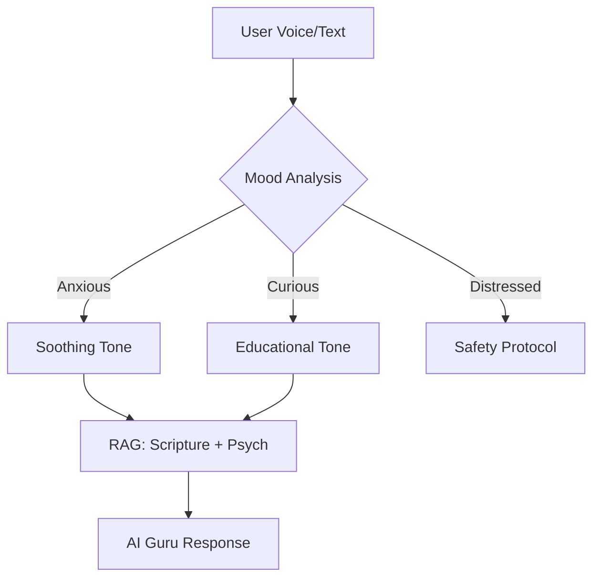

# AI Guru Engine: Logic & Safety

## Concept

The **AI Guru** is the heart of Soullink. It is an empathetic, voice-first guide that uses a combination of **Large Language Models (Gemini)** and **Vedic Knowledge Bases** to provide spiritual and psychological guidance.

## Core Logic

1.  **Mood Detection (Voice/Text):**
    - Analyzes vocal tone, pitch, and speed (via Vapi/Deepgram).
    - Performs sentiment analysis on text input.
    - _Example:_ If the user sounds "anxious," the Guru adopts a "Shanti" (Peaceful) tone.
2.  **Contextual Wisdom Retrieval:**
    - Uses RAG (Retrieval-Augmented Generation) to pull relevant Shlokas from the **Living Library**.
    - Combines ancient wisdom with modern psychological frameworks (CBT, Jungian).
3.  **The "Wise Friend" Persona:**
    - Avoids being "preachy."
    - Uses metaphors and storytelling (Itihasa/Puranas) to explain complex concepts.

## Safety & Ethics Protocols

1.  **Crisis Intervention:**
    - If keywords related to self-harm or severe mental distress are detected, the Guru immediately shifts to a "Safety Mode."
    - Provides local emergency numbers and encourages seeking professional help.
    - _Disclaimer:_ "I am an AI guide, not a licensed therapist."
2.  **Bias Mitigation:**
    - Ensures responses are inclusive and respect all spiritual paths.
    - Avoids political or controversial social commentary.
3.  **Data Privacy:**
    - All conversations are encrypted.
    - Users can choose to "Incognito" their session (no data saved).

## Technical Flow

